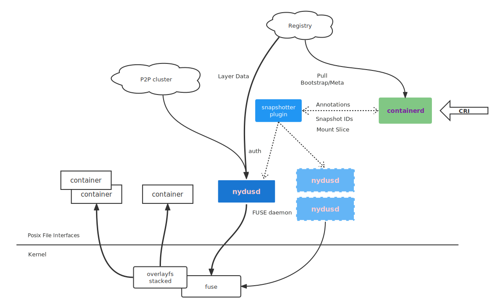

[**[⬇️ Download]**](https://github.com/containerd/nydus-snapshotter/releases)
[**[📖 Website]**](https://nydus.dev/)
[**[☸ Quick Start (Kubernetes)**]](https://github.com/containerd/nydus-snapshotter/blob/main/docs/run_nydus_in_kubernetes.md)
[**[🤓 Quick Start (nerdctl)**]](https://github.com/containerd/nerdctl/blob/master/docs/nydus.md)
[**[❓ FAQs & Troubleshooting]**](https://github.com/dragonflyoss/image-service/wiki/FAQ)

# Nydus Snapshotter

<p></p>

[](https://github.com/containerd/nydus-snapshotter/releases)
[](https://github.com/containerd/nydus-snapshotter/blob/main/LICENSE)

[](https://goreportcard.com/report/github.com/containerd/nydus-snapshotter)
[](https://twitter.com/dragonfly_oss)
[](https://github.com/dragonflyoss/image-service)

Nydus-snapshotter is a **non-core** sub-project of containerd.

Nydus snapshotter is an external plugin of containerd for [Nydus image service](https://nydus.dev) which implements a chunk-based content-addressable filesystem on top of a called `RAFS (Registry Acceleration File System)` format that improves the current OCI image specification, in terms of container launching speed, image space, and network bandwidth efficiency, as well as data integrity with several runtime backends: FUSE, virtiofs and in-kernel [EROFS](https://www.kernel.org/doc/html/latest/filesystems/erofs.html).

Nydus supports lazy pulling feature since pulling image is one of the time-consuming steps in the container lifecycle. Lazy pulling here means a container can run even the image is partially available and necessary chunks of the image are fetched on-demand. Apart from that, Nydus also supports [(e)Stargz](https://github.com/containerd/stargz-snapshotter) and OCI (by using [zran](https://github.com/dragonflyoss/image-service/blob/master/docs/nydus-zran.md)) lazy pulling directly **WITHOUT** any explicit conversion.

For more details about how to build Nydus container image, please refer to [nydusify](https://github.com/dragonflyoss/image-service/blob/master/docs/nydusify.md) conversion tool and [acceld](https://github.com/goharbor/acceleration-service).

## Architecture

### Architecture Based on FUSE



### Architecture Based on Fscache/Erofs


## Building

Just invoke `make` and check out the output executable binary `./bin/containerd-nydus-grpc`

```bash
make
```

## Integrate Nydus-snapshotter into Containerd

The following document will describe how to manually configure containerd + Nydus snapshotter. If you want to run Nydus snapshotter in Kubernetes cluster, you can try to use helm or run nydus snapshotter as a container. You can refer to [this documentation](./docs/run_nydus_in_kubernetes.md).

Containerd provides a general mechanism to exploit different types of snapshotters. Please ensure your containerd's version is 1.4.0 or above.
Add Nydus as a proxy plugin into containerd's configuration file which may be located at `/etc/containerd/config.toml`.

```toml
# The `address` field specifies through which socket snapshotter and containerd communicate.
[proxy_plugins]
  [proxy_plugins.nydus]
    type = "snapshot"
    address = "/run/containerd-nydus/containerd-nydus-grpc.sock"
```

Restart your containerd service making the change take effect. Assume that your node is systemd based, restart the service as below:

```bash
systemctl restart containerd
```

### Get Nydus Binaries

Get `nydusd` `nydus-image` and `nydusctl` binaries from [nydus releases page](https://github.com/dragonflyoss/image-service/releases).
It's suggested to install the binaries to your system path. `nydusd` is FUSE userspace daemon and a vhost-user-fs backend. Nydus-snapshotter
will fork a nydusd process when necessary.

### Configure Nydus

Please follow instructions to [configure nydus](./docs/configure_nydus.md) in order to make it work properly in your environment.

### Start Nydus Snapshotter

Nydus-snapshotter is implemented as a [proxy plugin](https://github.com/containerd/containerd/blob/04985039cede6aafbb7dfb3206c9c4d04e2f924d/PLUGINS.md#proxy-plugins) (`containerd-nydus-grpc`) for containerd.

Assume your server is systemd based, install nydus-snapshotter:
Note: `nydusd` and `nydus-image` should be found from $PATH.

```bash
make install
systemctl restart containerd
```

Or you can start nydus-snapshotter manually.

```bash
# `--nydusd` specifies the path to nydusd binary. If `nydusd` and `nydus-image` are installed, `--nydusd` and `--nydus-image`can be omitted.
# Otherwise, provide them in below command line.
# `address` is the domain socket that you configured in containerd configuration file
# `--nydusd-config` is the path to `nydusd` configuration file
# The default nydus-snapshotter work directory is located at `/var/lib/containerd-nydus`

$ sudo ./containerd-nydus-grpc --config /etc/nydus/config.toml --nydusd-config /etc/nydus/nydusd-config.json --log-to-stdout
```

### Validate Nydus-snapshotter Setup

Utilize containerd's `ctr` CLI command to validate if nydus-snapshotter is set up successfully.

```bash
$ ctr -a /run/containerd/containerd.sock plugin ls
TYPE                            ID                       PLATFORMS      STATUS
io.containerd.snapshotter.v1    nydus                    -              ok
```

### Optimize Nydus Image as per Workload

Nydus usually prefetch image data to local filesystem before a real user on-demand read. It helps to improve the performance and availability. A containerd NRI plugin [container image optimizer](docs/optimize_nydus_image.md) can be used to generate nydus image building suggestions to optimize your nydus image making the nydusd runtime match your workload IO pattern. The optimized nydus image has
a better performance.

## Quickstart Container with Lazy Pulling

### Start Container on single Node

Start container using `nerdctl` (>=v0.22) which has native nydus support with `nydus-snapshotter`.

```bash
# Start container by `nerdctl`
nerdctl --snapshotter nydus run ghcr.io/dragonflyoss/image-service/nginx:nydus-latest
```

### Start Container in Kubernetes Cluster

Change containerd's CRI configuration:

```toml
[plugins."io.containerd.grpc.v1.cri".containerd]
   snapshotter = "nydus"
   disable_snapshot_annotations = false
```

Use `crictl` to debug starting container via Kubernetes CRI. Dry run [steps](./docs/crictl_dry_run.md) of using `crictl` can be found in [documents](./docs).

### Setup with nydus-snapshotter image

We can also use the `nydus-snapshotter` container image when we want to put Nydus stuffs inside a container. See the [nydus-snapshotter example](./misc/example/README.md) for how to setup and use it.

## Integrate with Dragonfly to Distribute Images by P2P

Nydus is a sub-project of [Dragonfly](https://github.com/dragonflyoss/Dragonfly2). So it closely works with Dragonfly to distribute container images in a fast and efficient P2P fashion to reduce network latency and lower the pressure on a single-point of the registry.

### Quickstart Dragonfly & Nydus in Kubernetes

We recommend using the Dragonfly P2P data distribution system to further improve the runtime performance of Nydus images.

If you want to deploy Dragonfly and Nydus at the same time, please refer to this **[Quick Start](https://github.com/dragonflyoss/helm-charts/blob/main/INSTALL.md)**.

### Config Dragonfly mode

Dragonfly supports both **mirror** mode and HTTP **proxy** mode to boost the containers startup. It is suggested to use Dragonfly mirror mode. To integrate with Dragonfly in the mirror mode, please provide registry mirror in nydusd's json configuration file in section `device.backend.mirrors`

```json
{
  "mirrors": [
    {
      "host": "http://127.0.0.1:65001",
      "headers": "https://index.docker.io/v1/"
    }
  ]
}
```

### Hot updating mirror configurations

In addition to setting the registry mirror in nydusd's json configuration file, `nydus-snapshotter` also supports hot updating mirror configurations. You can set the configuration directory in nudus-snapshotter's toml configuration file with `remote.mirrors_config.dir`. The empty `remote.mirrors_config.dir` means disabling it.

```toml
[remote.mirrors_config]
dir = "/etc/nydus/certs.d"
```

Configuration file is compatible with containerd's configuration file in toml format.

```toml
[host]
  [host."http://127.0.0.1:65001"]
    [host."http://127.0.0.1:65001".header]
      # NOTE: For Dragonfly, the HTTP scheme must be explicitly specified.
      X-Dragonfly-Registry = ["https://p2p-nydus.com"]
```

Mirror configurations loaded from nydusd's json file will be overwritten before pulling image if the valid mirror configuration items loaded from `remote.mirrors_config.dir` are greater than 0.

## Community

Nydus aims to form a **vendor-neutral opensource** image distribution solution to all communities.
Questions, bug reports, technical discussion, feature requests and contribution are always welcomed!

We're very pleased to hear your use cases any time.
Feel free to reach/join us via Slack and/or Dingtalk.

- **Slack:** [Nydus Workspace](https://join.slack.com/t/nydusimageservice/shared_invite/zt-pz4qvl4y-WIh4itPNILGhPS8JqdFm_w)
- **Twitter:** [@dragonfly_oss](https://twitter.com/dragonfly_oss)
- **Dingtalk:** [34971767](https://qr.dingtalk.com/action/joingroup?code=v1,k1,ioWGzuDZEIO10Bf+/ohz4RcQqAkW0MtOwoG1nbbMxQg=&_dt_no_comment=1&origin=11)


- **Technical Meeting:** Every Wednesday at 06:00 UTC (Beijing, Shanghai 14:00), please see our [HackMD](https://hackmd.io/@Nydus/Bk8u2X0p9) page for more information.

## License

[](https://app.fossa.com/projects/git%2Bgithub.com%2Fcontainerd%2Fnydus-snapshotter?ref=badge_large)
