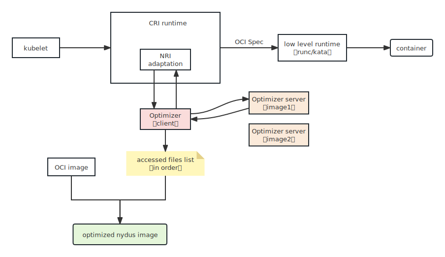

# Optimize a nydus image

To improve the prefetch hit rate, we can specify a prefetch table when converting an OCI image to a nydus image. The prefetch table is workload related and we should generate the list of accessed files in order when the workload is running. Nydus-snapshotter has implemented an optimizer with Containerd NRI plugin to optimize the nydus image. The optimizer is image format independent and requires NRI 2.0, which is available in containerd (>=v1.7.0). The optimizer subscribes container events to watch what files are opened and read, etc. during container application is starting up. This enables nydus image build tools to optimize the nydus image making it put the necessary and prioritized files into a special region of nydus image with extra image metadata. So nydus runtime can pull this files into local disk in top priority, thus to boost the performance further.

## Requirements

- [NRI 2.0](https://github.com/containerd/nri): Which has been integrated into containerd since [v1.7.0](https://github.com/containerd/containerd/tree/v1.7.0-beta.1).

## Workflow



1. Run the optimizer as a NRI plugin to run optimizer server when the StartContainer event occurs.
2. Optimizer server joins container mount namespace and starts fanotify server.
3. Optimizer server detects fanotify event and sends the accessed file descriptor to client.
4. Optimizer client converts file descriptor to path.
5. Generate list of accessed files on local disk.
6. Convert OCI images with accessed files list to nydus image.

## Generate an accessed files list

To install the optimizer and optimizer-server, invoke below command:

```console
make optimizer && make install-optimizer
```

This command installs the optimizer's default toml configuration file in `/etc/nri/conf.d/02-optimizer-nri-plugin.conf`. Here is an example:

```toml
# The directory to persist accessed files list for container.
persist_dir = "/opt/nri/optimizer/results"
# Whether to make the csv file human readable.
readable = false
# The path of optimizer server binary.
server_path = "/usr/local/bin/optimizer-server"
# The timeout to kill optimizer server, 0 to disable it.
timeout = 0
# Whether to overwrite the existed persistent files.
overwrite = false
# The events that containerd subscribes to.
# Do not change this element.
events = [ "StartContainer", "StopContainer" ]
```

Modify containerd's toml configuration file to enable NRI.

```console
sudo tee -a /etc/containerd/config.toml <<- EOF
[plugins."io.containerd.nri.v1.nri"]
  config_file = "/etc/nri/nri.conf"
  disable = false
  plugin_path = "/opt/nri/plugins"
  socket_path = "/var/run/nri.sock"
EOF

```

Containerd will load all NRI plugins in the `plugin_path` directory on startup. If you want to start a NRI plugin manually, please add the following configuration to allow other NRI plugins to connect via `socket_path`.

```console
sudo tee /etc/nri/nri.conf <<- EOF
disableConnections: false
EOF

```

Restart the containerd service.

```console
sudo systemctl restart containerd

```

Now, just run a container workload in sandbox and you will get the list of accessed files in `persist_dir`.
Note that NRI plugin can only be called from containerd/CRI. So start a container using `crictl` as below.

```console
sudo tee nginx.yaml <<- EOF
metadata:
  name: nginx
image:
  image: nginx:latest
log_path: nginx.0.log
linux: {}
EOF

sudo tee pod.yaml <<- EOF
metadata:
  name: nginx-sandbox
  namespace: default
  attempt: 1
  uid: hdishd83djaidwnduwk28bcsb
log_directory: /tmp
linux: {}
EOF

crictl run nginx.yaml pod.yaml

```

The result file for the nginx image is `/opt/nri/optimizer/results/nginx:latest`.

## Build Nydus Image with Optimizer's Suggestions

Nydus provides a [nydusify](https://github.com/dragonflyoss/image-service/blob/master/docs/nydusify.md) CLI tool to convert OCI images from the source registry or local file system to nydus format and push them to the target registry.

We can install the `nydusify` cli tool from the nydus package.

```console
VERSION=v2.1.5

wget https://github.com/dragonflyoss/image-service/releases/download/$VERSION/nydus-static-$VERSION-linux-amd64.tgz
tar -zxvf nydus-static-$VERSION-linux-amd64.tgz
sudo install -D -m 755 nydus-static/nydusify /usr/local/bin/nydusify
sudo install -D -m 755 nydus-static/nydus-image /usr/local/bin/nydus-image
```

A simple example converts the OCI image nginx to nydus format in RAFS V6.

```console
sudo nydusify convert --source nginx --target sctb512/nginx:nydusv6 --fs-version 6
```

With the `--prefetch-patterns` argument, we can specify the list of files to be written in the front of the nydus image and be prefetched in order when starting a container.

```console
sudo nydusify convert --source nginx --target sctb512/nginx:optimized-nydusv6 --fs-version 6 --prefetch-patterns < /opt/nri/optimizer/results/nginx:latest
```

On a host with nydus-snapshotter installed and configured properly, start a container with an optimized nydus image.

```console
sudo nerdctl --snapshotter nydus run --rm --net host -it sctb512/nginx:optimized-nydusv6
```
